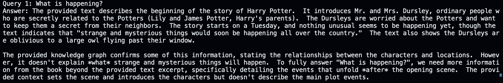
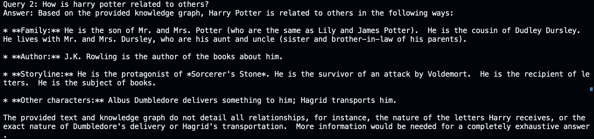
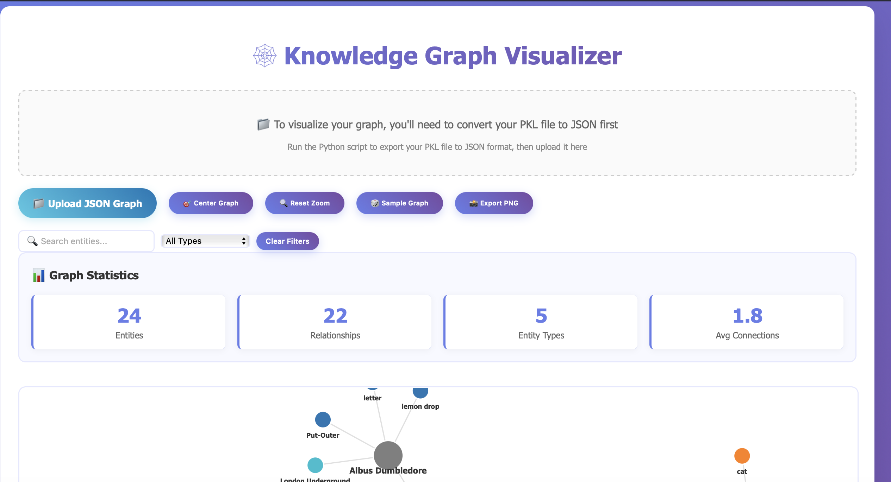
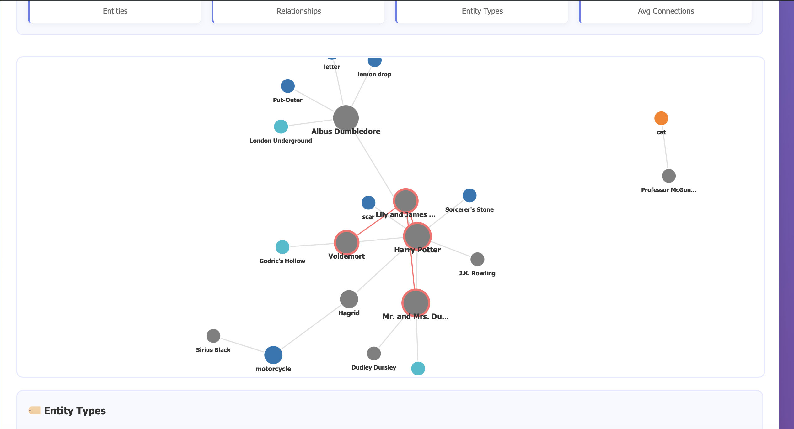

# Graph RAG

This repository implements a small Graph-based RAG (Retrieval-Augmented Generation) pipeline that extracts text from PDFs, uses Google Gemini to extract entities and infer relationships, builds a NetworkX knowledge graph, and answers natural-language queries using the graph and document context.

This fork has been updated to operate in Gemini-only mode (no local NER fallback). It also supports an incremental, cumulative knowledge graph: repeated runs will merge newly-extracted entities/relationships into a single cumulative `kg.pkl` file using simple normalized-name + substring-based deduplication.

---




## Highlights / Key behaviors

- Gemini-only extraction: the code requires the `google.generativeai` package and a `GEMINI_API_KEY` environment variable. The model is hardcoded to `gemini-1.5-flash`.
- Chunking: PDFs are read and split into sentence-based chunks to keep Gemini prompts reasonably sized.
- Structured Gemini prompts: entities and relationships are requested with explicit instructions to return JSON. The code is defensive and extracts JSON fragments from possibly noisy model outputs.
- Incremental merge: when the script is run repeatedly (for multiple queries or documents) it will merge new entities/relationships into the cumulative `kg.pkl` file, deduplicating using normalized-name matching and simple substring heuristics.
- Persistence: the cumulative graph is stored in `kg.pkl` as a pickled dict containing a NetworkX node-link graph plus `entities`, `relationships`, and `text_chunks`.

---





## File layout

- `main.py` — main implementation. Key components:
  - `GraphRAGLangGraph` class that defines the workflow nodes:
    - `_extract_text` — read PDF(s) with PyPDF2
    - `_chunk_text` — sentence-based chunking (~500–800 chars per chunk)
    - `_extract_entities` — call Gemini to extract structured entities, parse JSON, post-process and dedupe
    - `_extract_relationships` — call Gemini to infer relationships from the text and entities, parse JSON, dedupe
    - `_build_graph` — build a NetworkX graph from entities/relationships
    - `_answer_query` / `generate_answer` — call Gemini to generate a natural-language answer using a context summary built from the graph and text
    - `_merge_states` — incremental merge logic that merges a new GraphState into an existing one using normalized-name matching and substring heuristics; merges descriptions and mention counts and keeps higher-confidence relationships
    - `save_graph` / `load_graph` — persistence (pickle) using NetworkX node-link format for the graph plus entity/relationship metadata
  - `__main__` — reads queries from `queries.txt` (one per non-empty line) and runs the pipeline for each query, merging results into a single cumulative `kg.pkl`.
- `queries.txt` — place one query per line here. The `__main__` script reads this file and runs every query in sequence.

---

## Requirements

- Python 3.10+ (the dev container here uses Python 3.12)
- Install dependencies in a virtual environment. Example (in the repo root):

```bash
python -m venv .venv
source .venv/bin/activate
pip install -r requirements.txt
```

If you don't have a `requirements.txt`, install the main runtime packages manually:

```bash
pip install google-generativeai networkx pydantic PyPDF2 numpy
```

Notes:
- `google-generativeai` must be importable and you must set `GEMINI_API_KEY` in your environment to a valid Gemini API key.

---

## How to run

1. Add one or more queries to `queries.txt` (one query per non-empty line).
2. Put PDFs you want to analyze into the `data/` folder (the code uses `data/<basename>` paths).
3. Ensure `GEMINI_API_KEY` is set in your environment.
4. Run:

```bash
source .venv/bin/activate   # if using virtualenv
python main.py
```

The script will iterate through each query in `queries.txt`, run the pipeline, and merge results into `kg.pkl` in the repo root. After each query you'll see a printed natural-language `Answer: ...` and a short summary of cumulative entities and relationships.

---

## Merging behavior (detailed)

When `main.py` runs with `save_path` set to the cumulative `kg.pkl` file and that file already exists, the pipeline will:

1. Load the existing `kg.pkl` (pickled dict) and convert it into an internal `GraphState`.
2. Extract entities and relationships from the new PDF(s) / query run using Gemini.
3. Merge the new `GraphState` into the existing one using `_merge_states`:
   - Entities are normalized (whitespace normalized) and matched by exact normalized name or simple substring inclusion. The longer name is preferred as canonical when merging.
   - Descriptions are concatenated and mention counts (if present in descriptions) are summed.
   - Relationship endpoints (source/target) are remapped to canonical entity display names and relationships are deduplicated (keeping the higher-confidence relation when duplicates are found).
4. The merged graph (entities+relationships) is rebuilt into a NetworkX graph and then saved back to `kg.pkl`.

This is a lightweight, heuristic merge designed for small- to medium-sized datasets. It aims to avoid simple duplicates (same name with minor differences) but is not a full entity-resolution system.

---

## Limitations & Risks

- Gemini-only: this code will raise on startup if `google.generativeai` is not installed or `GEMINI_API_KEY` not provided. There is no local fallback (spaCy) in this branch.
- Heuristic merging: the current `_merge_states` is intentionally simple. It can over-merge or under-merge. Consider adding fuzzy string matching or embedding-based comparison for higher fidelity.
- Pickle-based persistence: `kg.pkl` is a pickle of a dict containing a node-link graph. Pickle is not safe to load from untrusted sources. For more portability and safety, consider switching to a JSON format with versioning or using a database.
- Gemini costs: each run performs entity + relationship extraction and answer generation calls. Expect API costs proportional to document size and number of queries.
- No concurrency control: concurrent runs writing to `kg.pkl` will race.

---

## Recommended next steps (if you want me to implement any)

1. Add fuzzy matching with `rapidfuzz` or embeddings-based matching to improve deduplication.
2. Introduce canonical stable IDs for entities (UUIDs) and persist entities by ID rather than by display name.
3. Replace pickle with JSON + versioned schema, or switch to SQLite/graph DB for safe incremental updates.
4. Add a validation tool that checks for orphan relationships and reports merge statistics per run.
5. Add batching / caching for Gemini calls to lower latency and cost.

If you tell me which of these you want next, I can implement it and add tests.

---

## Contact / attribution

This code was adapted and extended in-repo to integrate Gemini for higher-quality entity/relationship extraction and to support a cumulative KG merge workflow. If you need help with productionization (secure persistence, soft-fallbacks, or vectorstore integration) I can propose a design and implement the initial steps.
# Knowledge Graph RAG

## Overview

This project builds and visualizes a knowledge graph from PDF documents using Retrieval-Augmented Generation (RAG) techniques and Google Gemini API. It includes tools for graph construction, analysis, and interactive/static visualization.

## Features

- **PDF Extraction:** Extracts text from PDFs and chunks it for processing.
- **Entity & Relationship Extraction:** Uses Gemini API to identify entities and relationships.
- **Knowledge Graph Construction:** Builds a graph using NetworkX.
- **Embeddings:** Uses Sentence Transformers for semantic similarity.
- **Visualization:** 
  - Static (Matplotlib PNG)
  - Interactive (Plotly HTML)
  - D3.js browser-based viewer
- **Statistics & Charts:** Entity type distribution, network metrics.
- **Export:** Graph data in PKL and JSON formats.

## Directory Structure

```
graph_rag/
│
├── main.py                # Main script: builds the knowledge graph from PDFs
├── graph_visualizer.py    # Visualization and statistics (matplotlib, plotly, charts)
├── graph_viewer.html      # D3.js interactive graph viewer (upload JSON)
├── graph_interactive.html # Plotly interactive graph (open in browser)
├── entity_types.html      # Entity type distribution chart
├── graph_matplotlib.png   # Static PNG visualization
├── knowledge_graph.pkl    # Saved knowledge graph (pickle)
├── knowledge_graph.json   # Exported graph (JSON)
├── pkl_to_json.py         # Converts PKL graph to JSON
├── load_graph.py          # Loads and queries the graph
├── data/
│   └── sample.pdf         # Example PDF
└── README.md              # This file
```

## Setup

1. **Clone the repository:**
	```bash
	git clone <repo-url>
	cd graph_rag
	```

2. **Install dependencies:**
	```bash
	pip install -r requirements.txt
	```
	Required packages include: `networkx`, `matplotlib`, `plotly`, `PyPDF2`, `sentence-transformers`, `scikit-learn`, `google-generativeai`, `python-dotenv`.

3. **Set up Gemini API Key:**
	- Get your API key from Google Gemini.
	- Set it as an environment variable:
	  ```bash
	  export GEMINI_API_KEY="your_api_key_here"
	  ```
	- Or add it to a `.env` file.

## Usage


### 1. Build the Knowledge Graph

Run the main script to process PDFs and build the graph:
```bash
python main.py
```
- By default, it uses `data/sample.pdf`. Update the `pdf_files` list in `main.py` to use your own PDFs.

### 2. Set Your Queries

Queries are now loaded from the `queries.txt` file in the project directory. To change the questions asked to the knowledge graph, simply edit `queries.txt` and add, remove, or modify queries (one per line). Lines starting with `#` are treated as comments and ignored.

Example `queries.txt`:
```
What are the main concepts discussed in the documents?
# What relationships exist between entities?
```

### 2. Visualize the Graph

#### Static Visualization
Generates a PNG image:
```bash
python graph_visualizer.py
```
- Output: `graph_matplotlib.png`

#### Interactive Visualization
Generates an HTML file:
```bash
python graph_visualizer.py
```
- Output: `graph_interactive.html`
- Open in your browser: `http://localhost:8000/graph_interactive.html`

#### D3.js Viewer
- Open `graph_viewer.html` in your browser: `http://localhost:8000/graph_viewer.html`
- Upload the exported `knowledge_graph.json` to view and interact with the graph.

#### Entity Type Chart
- Output: `entity_types.html`

### 3. Export Graph Data

Convert the PKL graph to JSON:
```bash
python pkl_to_json.py
```
- Output: `knowledge_graph.json`


### 4. Query the Graph

Use `load_graph.py` to load and query the graph with natural language questions.


## License

MIT License


